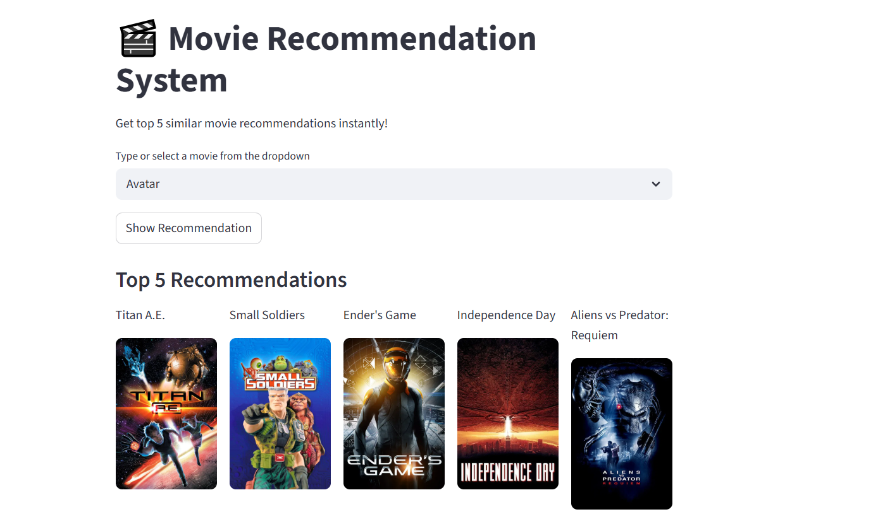

# 🎬 Movie Recommendation System

A machine learning-based web application that recommends movies similar to your selected choice using content-based filtering.

---

## 🚀 Live Demo

https://movie-recommendation-system-lsfpeqsfom6wltnxmzut6q.streamlit.app/

---

## 📌 Features

* 🎯 Recommends top 5 similar movies
* 🧠 Uses content-based filtering
* 🖼️ Displays movie posters using TMDB API
* ⚡ Fast and interactive UI built with Streamlit
* 🔄 Handles missing posters gracefully

---

## 🛠️ Tech Stack

* Python
* Pandas
* Scikit-learn
* Streamlit
* TMDB API

---

## 📊 How It Works

1. Movie data is preprocessed and cleaned
2. Important features like genres, keywords, cast, and crew are combined
3. Text data is vectorized using CountVectorizer
4. Cosine similarity is used to find similar movies
5. Top 5 similar movies are recommended

---

## 📂 Project Structure

```
movie-recommender-system/
│
├── app.py
├──.gitattributes
├── screenshot.png
├── movie_list.pkl
├── similarity.pkl
├── requirements.txt
└── README.md
```

---

## ⚙️ Installation & Setup

1. Clone the repository

```
git clone https://github.com/your-username/movie-recommender-system.git
```

2. Navigate to the project folder

```
cd movie-recommender-system
```

3. Install dependencies

```
pip install -r requirements.txt
```

4. Run the app

```
streamlit run app.py
```

---

## 🔑 API Setup

* This project uses TMDB API for fetching movie posters
* Replace `e83c81f3f7b32d2a67e9d6a1fc412825` in `app.py` with your own API key

---

## 📸 Sample



---

## 🎯 Future Improvements

* Add movie ratings and overview
* Improve recommendation accuracy
* Deploy with database support
* Add search autocomplete

---

## 💡 Acknowledgements

* TMDB (The Movie Database) API
* Streamlit for UI framework

---

## 📬 Contact

Feel free to connect for feedback or collaboration!
